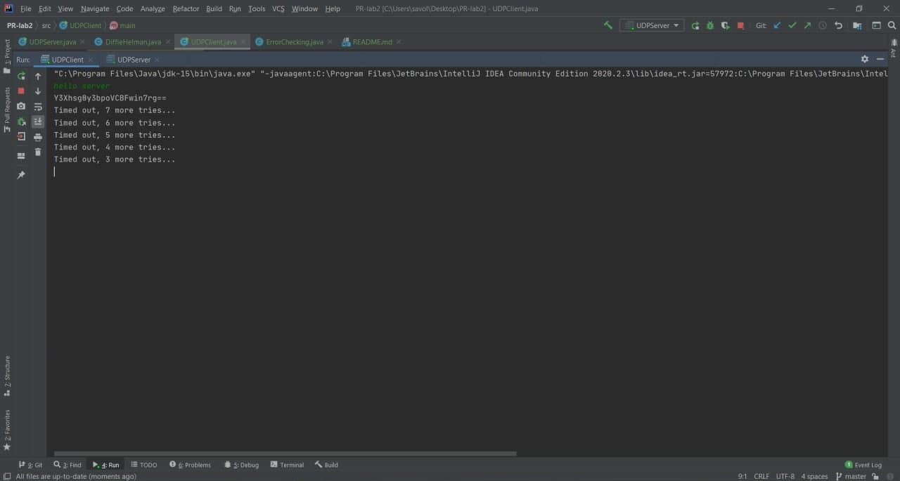
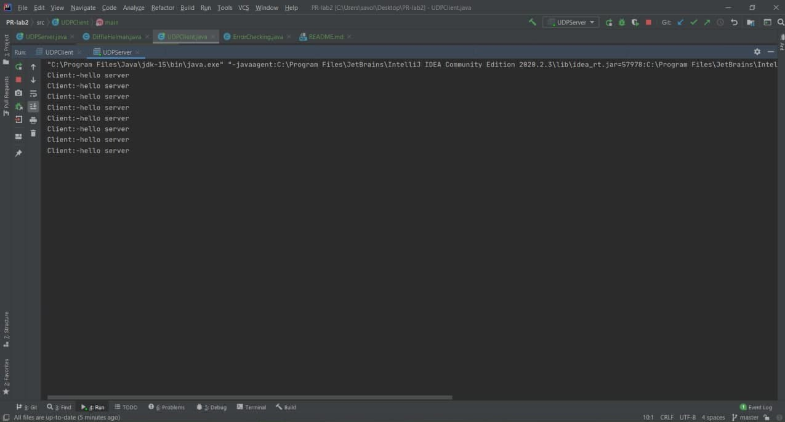

# Networking Programmin. Laboratory work no.2

#### Author: *Savitchi Olivia*

### Main Task
* Implement a protocol atop UDP, with error checking and retransmissions. Limit the number of retries for retransmission.
* Make the connection secure, using either a CA to get the public key of the receiver and encrypt data with it, or using Diffie-Helman to get a shared connection key between client and server, ensure that the traffic is encrypted.
* Regarding the application-level protocol, you have 3 options:
    * make an FTP-like protocol for data transfer, thus you will need to ensure data splitting and in-order delivery and reassembly at the destination. The protocol must support URIs, file creation and update (PUT), file fetching (GET) and metadata retrieval (OPTIONS);
    * make a protocol based on the workings (state machine) of an ATM;
    * make a protocol based on the workings (state machine) of a stationary telephone;
    
### Implementation

#### 1. UDP client-server
In order to do this laboratory work I implemented a client-server UDP protocol. 
``DatagramPacket`` and ``DatagramSocket`` are the two main classes that are used to implement a UDP client/server application. 
``DatagramPacket`` is a data container and ``DatagramSocket`` is a mechanism to send and receive ``DatagramPackets``. So, I created two main classes ``UDPClient.java`` and ``UDPClient.java``,
and the messages are encapsulated in a ``DatagramPacket`` which is sent through a ``DatagramSocket``.
```  
DatagramPacket sendPacket = new DatagramPacket(bytesToSend, bytesToSend.length, serverAddress, 4300); 
```

#### 2. ErrorChecking 
In UDP there are no error checking,error correction, or acknowledgment, so that is why I tried to implement Error Detection using Checksum. 
Checksums are used in order to check that a complete message has been received. Upon receiving a new message, the checksum can be recomputed and compared to the received checksum to ensure that no bits have been lost.
Thus, I created a class ``ErrorChecking.java`` that calculates the checksum using the byte array:
```    
    public static long getCRC32Checksum(byte[] bytes) {
          Checksum crc32 = new CRC32();
          crc32.update(bytes, 0, bytes.length);
          return crc32.getValue();
    }
```
Here, I am using Java's built-in ``CRC32`` class. Once the class is instantiated, the update method to update the Checksum instance with the bytes from the input is used.
The ``update`` method replaces the bytes held by the ``CRC32 Object``, and after setting the bytes, it exports the checksum with the ``getValue`` method.

### 3. Retransmission 
Retransmission means resending the packets over the network that have been either lost or damaged. Here, retransmission is a mechanism used to provide reliable communication.
In the ``UDPClient.java`` class  I used the ``MAXTRIES`` variable and the ``TIMEOUT`` variable with 3000 miliseconds, so I limited the number of retransmissions to 8 times.
```
    do {
        socket.send(sencData);          // Send the echo string
            try {
                socket.receive(receivePacket);  // Attempt echo reply reception

                if (!receivePacket.getAddress().equals(serverAddress)) {// Check source
                    throw new IOException("Received packet from an unknown source");
                }
                receivedResponse = true;
            } catch (InterruptedIOException e) {  // We did not get anything
                tries += 1;
                System.out.println("Timed out, " + (MAXTRIES - tries) + " more tries...");
            }

    } while ((!lineReader.equals("close")) && (!receivedResponse) && (tries < MAXTRIES));
```

#### 4. Secure Connection
In order to do a secure connection I tried to implement The Diffie-Hellman Key Exchange algorithm. The algorithm is used for sharing the keys between two parties. 
The intruder cannot calculate the key until he cracks the private value of one of the parties. Thus, I created a ``DiffieHelman.java`` class that has two main methods, to encrypt and decrypt data using ``AES`` algorithm.
```
public static String encrypt(String encryptString, String secret) {
        try {
            setKey(secret);
            Cipher cipher = Cipher.getInstance("AES/ECB/PKCS5Padding");
            cipher.init(Cipher.ENCRYPT_MODE, secretKey);
            return Base64.getEncoder().encodeToString(cipher.doFinal(encryptString.getBytes("UTF-8")));
        } catch (Exception e) {
            System.out.println("Exception: " + e.toString());
        }
        return null;
    }

    public static String decrypt(String decryptString, String secret) {
        try {
            setKey(secret);
            Cipher cipher = Cipher.getInstance("AES/ECB/PKCS5PADDING");
            cipher.init(Cipher.DECRYPT_MODE, secretKey);
            return new String(cipher.doFinal(Base64.getDecoder().decode(decryptString)));
        } catch (Exception e) {
            System.out.println("Exception: " + e.toString());
        }
        return null;
    }
```
#### 5.Results

I tried to implement an ATM for the application level protocol, but I have some issues. 
Finally, I have :



